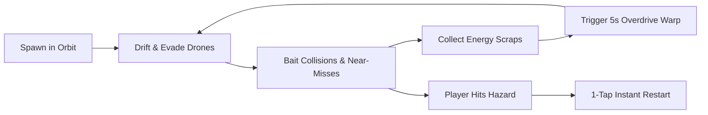

# Orbit Drift: Asteroid Fugitive — Game Development Plan

> **Project:** Orbit Drift: Asteroid Fugitive  
> **Platform:** YouTube Playables (Web / HTML5 Canvas — Mobile & Desktop responsive)  
> **Target Package Size:** < 3.5 MB (Instant startup, zero runtime latency)  
> **Target FPS:** 60 FPS on mid-tier mobile webviews and desktop browsers  
> **Estimated MVP Build Time:** 3–4 Days  

---

## 1. Executive Summary & Core Game Design

### 1.1 The Concept
*Orbit Drift: Asteroid Fugitive* is an agile, top-down arcade evasion game. The player pilots a rogue light scout ship escaping an interstellar quarantine zone through a volatile asteroid field. Hostile police patrol drones and heavy hunter ships pursue in relentless numbers.

With **no primary weapons**, the player's sole weapon is **momentum, drift physics, and environment exploitation**:
1. Cutting tight drift turns to force pursuing interceptors into colliding with each other.
2. Slingshotting around super-dense gravity wells to fling pursuers out of orbit or crush them against rocky asteroids.
3. Scoring "Near-Miss" multipliers and collecting floating energy cores dropped from destroyed enemies.

### 1.2 The 30-Second Core Loop


* **Seconds 0–5:** Spawn in an open orbital sector. 2 light patrol drones engage pursuit. Player initiates drift steering.
* **Seconds 6–15:** 4 more drones spawn; player lures them into a tight circle around a giant rotating asteroid. Two drones ram each other and detonate (`DOUBLE KILL! +500`).
* **Seconds 16–25:** Gravity singularity forms in the sector center. Player executes an orbit slingshot; pursuing heavy drone gets pulled into the singularity vortex and crushed.
* **Seconds 26–30:** Energy gauge fills to 100%, unlocking a temporary *Quantum Overdrive* boost to smash through remaining debris, culminating in a sector clear or high-score submission.

### 1.3 Control Scheme (Zero Friction)
* **Desktop Keyboard:**
  * `A` / `Left Arrow` = Hard Port Turn (Counter-Clockwise Drift)
  * `D` / `Right Arrow` = Hard Starboard Turn (Clockwise Drift)
  * `Space` or `W` = Nitro Burst / Thruster Surge (Limited Fuel Gauge)
* **Mobile Touch:**
  * Left half of screen = Steer Left
  * Right half of screen = Steer Right
  * Two-finger tap / Double-tap = Nitro Burst

---

## 2. Technical Architecture & Engine Stack

### 2.1 Stack Decisions
* **Engine:** Pure HTML5 Canvas 2D with lightweight custom physics loop (alternative: **LittleJS** or **Phaser 3 Minimal Arcade**).
* **Rationale:** Zero external framework bloat guarantees sub-second load times on YouTube Playables, runs natively inside sandboxed `<iframe>` environments, and allows total control over deterministic drift math.
* **Audio:** Native **Web Audio API** synthesized sound effects (procedural chiptune engine sounds, explosions, laser whines, grav-well hums). Zero audio file load times.

### 2.2 Core Modules Architecture
```
Orbit Drift/
├── index.html               # Unified single-page launcher (YouTube Playables spec)
├── AsteroidFugitivePlan.md   # This master plan
├── assets/
│   ├── sprites/             # Generated & packed sprite sheets
│   │   ├── ships.png        # Player & Enemy variants
│   │   ├── asteroids.png    # Rotating rocky hazard frames
│   │   └── fx.png           # Explosions, debris particles, pickup orbs
│   └── backgrounds/
│       └── deep_space.webp  # Parallax space dust & nebula background
├── src/
│   ├── engine/
│   │   ├── GameLoop.js      # Fixed-timestep physics update (60Hz) & variable render
│   │   ├── Input.js         # Unified touch, mouse, and keyboard mapper
│   │   └── SoundSynth.js    # Web Audio API sound generator
│   ├── entities/
│   │   ├── Player.js        # Inertia, drift friction, thruster vector math
│   │   ├── Drone.js         # AI pursuer with predictive steering & turn-radius limits
│   │   ├── Asteroid.js      # Rotating rigid body obstacle with mass & momentum
│   │   └── GravityWell.js   # Radial inverse-square gravitational force field
│   ├── systems/
│   │   ├── CollisionSystem.js # Circle-to-circle & SAT convex hull detection
│   │   ├── ParticleSystem.js  # Thruster trails, spark emitters, shockwaves
│   │   └── ScoreSystem.js     # Multipliers, near-miss triggers, session stats
│   └── main.js              # State manager (Title, Playing, GameOver, Scoreboard)
```

---

## 3. Comprehensive Graphics Generation Plan

To stand out on YouTube Playables while maintaining crystal-clear mobile readability, the visual identity blends **modern neon vector styling** with **high-contrast sci-fi industrial sprites**.

### 3.1 Visual Direction & Color Palette
* **Background:** Deep space abyss `#060814` with subtle midnight-blue `#0c102b` nebula dust.
* **Player Ship:** High-visibility electric cyan `#00f0ff` with pure white cockpit canopy and neon cyan thruster plumes.
* **Enemy Drones:** Hostile hazard amber `#ff3344` (Interceptors) and industrial caution yellow `#ffb703` (Heavy Rammers).
* **Asteroids:** Dark volcanic graphite `#2b2d42` with glowing mineral veins `#8d99ae`.
* **Gravity Wells:** Swirling violet-magenta `#d902ee` singularity with accretion distortion.
* **Pickups:** Pulsing golden plasma `#ffe600`.

---

### 3.2 Asset Generation Inventory & AI Prompts

We will use the built-in AI image generation system to produce clean, high-resolution source sprites, which will then be alpha-masked, trimmed, and packed into sprite sheets.

#### Asset 1: Player Fugitive Scout Ship
* **Filename:** `assets/sprites/player_scout.png`
* **Output Specs:** Top-down orthographic 2D sprite, 512x512, transparent background.
* **AI Generation Prompt:**
  > *"Top-down 2D game sprite of a futuristic agile scout spaceship, sleek arrowhead aerodynamic hull, glowing cyan blue engine thrusters, white and chrome plating with cyan neon energy accents, clean orthographic top view, centered, isolated on solid pure black background, crisp edges, vector video game asset style, no shadows underneath, 4k."*

#### Asset 2: Light Police Interceptor Drone (Enemy Type A)
* **Filename:** `assets/sprites/enemy_interceptor.png`
* **Output Specs:** Top-down orthographic 2D sprite, 512x512, transparent background.
* **AI Generation Prompt:**
  > *"Top-down 2D game sprite of a hostile high-speed police drone interceptor, twin forward needle prongs, aggressive sharp angular design, crimson red and matte dark grey armor, glowing red ocular sensors and red rear thruster exhaust, orthographic top view, centered, isolated on solid pure black background, flat lighting, arcade video game asset."*

#### Asset 3: Heavy Enforcer Rammer (Enemy Type B)
* **Filename:** `assets/sprites/enemy_rammer.png`
* **Output Specs:** Top-down orthographic 2D sprite, 512x512, transparent background.
* **AI Generation Prompt:**
  > *"Top-down 2D game sprite of a heavy armored space patrol vessel, bulky bulldozer-like reinforced prow for ramming, caution yellow and industrial charcoal hazard stripes, twin orange heavy engine thrusters, top-down orthographic view, centered, isolated on solid pure black background, clean hard edges."*

#### Asset 4: Asteroid Variants (Small, Medium, Large)
* **Filename:** `assets/sprites/asteroids_sheet.png`
* **Output Specs:** Top-down orthographic rocks, distinct silhouette shapes, 1024x1024 sheet.
* **AI Generation Prompt:**
  > *"Sprite sheet containing 4 distinct detailed space asteroids, jagged irregular rocky meteorites, craters and metallic mineral seams glowing faintly blue, top-down isometric view, evenly spaced grid, isolated on pure black background, high contrast, clean contours for 2D game collision."*

#### Asset 5: Gravity Singularity Vortex
* **Filename:** `assets/sprites/singularity_core.png`
* **Output Specs:** 512x512 radial vortex core.
* **AI Generation Prompt:**
  > *"Top-down 2D sci-fi game asset of a miniature black hole singularity, swirling luminous purple and magenta accretion disk, deep black gravitational sphere center with glowing event horizon rim, spiral cosmic matter vortex, centered circular shape, isolated on pure black background."*

#### Asset 6: Seamless Deep Space Parallax Backdrop
* **Filename:** `assets/backgrounds/space_nebula_tile.png`
* **Output Specs:** 1024x1024 seamless tiling texture.
* **AI Generation Prompt:**
  > *"Seamless tiling background texture of deep outer space, sparse distant glowing cyan and violet stars, subtle dark purple cosmic nebula gas dust, high aesthetic, clean dark background suitable for fast-paced arcade game overlay, tileable seamlessly."*

---

### 3.3 Dynamic In-Engine Procedural Graphics (Zero Load Time)
In addition to static sprite art, the game relies heavily on dynamic Canvas 2D procedural rendering for responsive juice and tactile feedback:
1. **Ribbon Thruster Trails:** Bezier curve history trail tracking player coordinates, fading with alpha gradient from `#00f0ff` to `#0044ff00`.
2. **Drift Skid Marks (Space Ion Residue):** When drift angle exceeds 45°, lateral thruster emitters burst dual particle lines that linger in space coordinates for 1.5 seconds.
3. **Shockwave Rings:** On enemy-to-enemy collisions, an expanding canvas circle (`ctx.arc`) with decreasing stroke width and white-to-transparent gradient simulates concussive force.
4. **Near-Miss Bullet-Time Glow:** When an enemy drone misses the player by less than 25px, a brief screen-space chromatic vignette flashes cyan for 120ms with a slow-motion deceleration pitch.

---

### 3.4 Sprite Optimization & Packaging Pipeline
1. **Alpha Channel Extraction:** Scripted black-pixel keying / chroma transparency conversion for all generated sprite images.
2. **Packing into Master Texture Atlas:** Merge ships, asteroids, and FX frames into a single `atlas.webp` (lossless webp format, < 600 KB).
3. **Canvas Fallback Vectors:** Implement programmatic geometric draw routines (canvas arcs and polygons) that execute immediately if an image asset is delayed in loading, ensuring the game is 100% playable in 0ms.

---

## 4. Physics & AI Mechanics Specification

### 4.1 Drift Steering Math
```javascript
// Player velocity model combining forward thrust and drift slip
const turnSpeed = isSteeringLeft ? -ROTATION_RATE : (isSteeringRight ? ROTATION_RATE : 0);
angle += turnSpeed * dt;

// Forward propulsion vector
const forwardX = Math.cos(angle) * SPEED;
const forwardY = Math.sin(angle) * SPEED;

// Drift interpolation (tighter drift at high speeds)
velocityX = lerp(velocityX, forwardX, DRIFT_GRIP * dt);
velocityY = lerp(velocityY, forwardY, DRIFT_GRIP * dt);

x += velocityX * dt;
y += velocityY * dt;
```

### 4.2 Enemy AI: Predictive Pursuit with Inelastic Turn Lag
The key to making "crash baiting" feel fair and rewarding is giving enemy drones higher top speed than the player, but **much wider turning radii (higher steering inertia)**:
* Drone calculates player's future position: $\vec{P}_{\text{future}} = \vec{P} + \vec{V}_{\text{player}} \cdot t_{\text{intercept}}$.
* Drone rotates toward $\vec{P}_{\text{future}}$ at a fixed max angular velocity ($\omega_{\text{drone}} < \omega_{\text{player}}$).
* When the player executes a sudden 90° or 180° drift around an obstacle, the drone's forward momentum carries it directly into the obstacle or another converging drone.

---

## 5. Phased Implementation Roadmap

### Phase 1: Core Physics & Drift Sandbox (Day 1)
- [ ] Initialize `Orbit Drift/index.html` single-canvas shell with full responsive viewport scaling.
- [ ] Implement player drift physics (inertia, lateral slip friction, rotation rates).
- [ ] Add dual-touch and keyboard controls.
- [ ] Implement the dynamic ribbon particle thruster trail.

### Phase 2: AI Enemy Chasers & Bait Mechanics (Day 1–2)
- [ ] Implement Drone entity pool with predictive pursuit steering.
- [ ] Add Drone-to-Drone collision damage & explosion triggers.
- [ ] Build circular asteroid obstacle spawning with randomized angular velocities.
- [ ] Establish Near-Miss detection radius and floating score numbers.

### Phase 3: Graphics Generation & Sprite Sheet Assembly (Day 2)
- [x] Execute AI image generation for Player Ship, Interceptor, Heavy Rammer, Asteroids, and Galaxy backdrop.
- [x] Process transparent sprites, pack into asset directory.
- [x] Hook up sprite renderer with rotation angles and frame animators.
- [x] Add procedural screen-shake and collision shockwave rings.
- [x] Add dual Ion Drift skid marks (wingtip lateral burn streaks).

### Phase 4: Gravity Wells, Pickups & Audio Synth (Day 3)
- [x] Implement Gravity Singularity entities (radial pull forces on ships and debris).
- [x] Add Energy Core drops from destroyed enemies with auto-magnet collection.
- [x] Implement Web Audio API procedural sound synthesizer (dynamic engine hum, thruster whines, boom bursts, near-miss chime).
- [x] Implement high-score persistence (`localStorage` with YouTube Playables session bridge).

### Phase 5: YouTube Playables Wrapper & Mobile Tuning (Day 4)
- [x] Implement DPR Scaling Cap (max 2.0) to prevent GPU fill-rate thermal throttling on 3x/4x mobile screens.
- [x] Implement Fixed 60Hz Physics Timestep accumulator (decoupling render rate from physics simulation for 90Hz/120Hz ProMotion displays).
- [x] Integrate HTML5 Touch Haptic Vibration API (`navigator.vibrate`) for near-misses, explosions, overdrive, and game-over feedback.
- [x] Add pause/resume event listeners (`visibilitychange` and window blur).
- [x] Conduct final performance profiling to verify solid 60 FPS and < 3 MB bundle size.

---

## 6. Success Metrics & Verification Checklist

| Metric | Target Goal | Verification Method |
| :--- | :--- | :--- |
| **Initial Bundle Size** | $< 3.5\text{ MB}$ total | Local HTTP header check & directory audit |
| **Boot-to-Play Time** | $< 1.5\text{ seconds}$ on 4G | Chrome DevTools network throttling simulation |
| **Frame Rate Stability** | $60\text{ FPS}\pm 2$ during 30+ simultaneous entities | Chrome DevTools FPS meter during wave 5+ |
| **Input Latency** | $< 16\text{ ms}$ (single frame) | Direct touch/keyboard event timestamp logging |
| **Crash Bait Satisfaction** | Enemies reliably collide when player dodges | Playtesting: > 75% of drone kills occur via collisions |

---

*Plan created on Sep 16, 2026. Ready for immediate Phase 1 execution.*
